# Teebay

Teebay is a simple web application for renting, buying, and selling products. It allows users to register, log in, manage their products, browse listings from other users, and perform transactions like buying or renting items. The application is built with a React frontend, a Node.js backend using GraphQL, Prisma as the ORM, and PostgreSQL as the database.

## Features

- **User Registration and Login**: Users can create an account and log in using simple string matching for authentication (not fully secured, as per challenge assumptions).
- **Add Product**: A multi-page form for adding products, allowing users to navigate back and forth to edit details before submission. Products include title, description, categories (e.g., ELECTRONICS, FURNITURE), pricing options, and availability for buy/rent.
- **Edit Product**: Users can update details of their owned products.
- **Delete Product**: Users can remove their owned products, which also handles cache eviction in Apollo InMemoryCache.
- **List All Products**: View a marketplace listing of all products created by users.
- **Buy Product**: Users can purchase available products. Once accepted, the product is marked as bought, and the transaction is recorded.
- **Rent Product**: Users can rent available products by specifying start and end dates. Overlaps in rental periods are handled to prevent conflicts.
- **User Dashboard**: Displays all products bought, sold, borrowed, or lent by the logged-in user.
- **Data Caching**: Uses Apollo InMemoryCache for efficient data storage on the frontend, with automatic eviction on deletions to avoid stale data. Unnecessary caching is minimized.
- **Categories and Pricing**: Products can belong to multiple categories (ELECTRONICS, FURNITURE, HOME_APPLIANCES, SPORTING_GOODS, OUTDOOR, TOYS). Rental pricing supports types like DAY, HOUR, or MONTH.
- **Additional Considerations**: Input validation, error handling (e.g., rental overlaps, unavailable products), and user feedback are implemented. The app focuses on reusability (e.g., shared form components) and best practices like modular component architecture and meaningful commit messages.

For detailed technical explanations, corner cases, and implementation notes, refer to [documentation.md](./documentation.md).

## Technologies Used

- **Frontend**: React with Apollo Client for GraphQL queries/mutations, React Hook Form for forms, and Mantine for UI components.
- **Backend**: Node.js with Express.js and GraphQL (using Apollo Server).
- **Database**: PostgreSQL with Prisma ORM (including migrations).
- **Containerization**: Docker for easy setup and running the app.

## ER Diagram

This diagram shows the relationships:

A User owns multiple Products (one-to-many).  
A Product can have multiple Purchases and Rentals (one-to-many).  
A Purchase involves a Seller (User), Buyer (User), and Product.  
A Rental involves a Renter (User) and Product (lender implied as Product owner).  
Categories and PricingType are enums stored as arrays or single values in Products.

---    